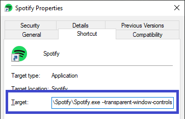

# DefaultDynamic for [Spicetify](https://github.com/khanhas/spicetify-cli)

<a href="https://github.com/JulienMaille/spicetify-dynamic-theme/releases/latest"></a>

This is a tweaked version of the Default theme.
The main differences are the light/dark toggle, the background cover and the dynamic highlight color, ie. it will match the current album art.

## Preview


## Install / Update

Make sure you are using Spicetify >= v2.6.0 and Spotify >= v1.1.67.

### Windows (PowerShell)

```powershell
Invoke-WebRequest -UseBasicParsing "https://raw.githubusercontent.com/JulienMaille/spicetify-dynamic-theme/master/install.ps1" | Invoke-Expression
```

### Linux/MacOS (Bash)

```bash
curl -fsSL https://raw.githubusercontent.com/JulienMaille/spicetify-dynamic-theme/master/install.sh | sh
```

### Manual Install

1. Download the latest [Source code (zip)](https://github.com/JulienMaille/spicetify-dynamic-theme/releases/latest)
2. Extract the files to your [Spicetify/Themes folder](https://github.com/khanhas/spicetify-cli/wiki/Customization#themes) (rename the zipped folder to `DefaultDynamic`)
3. Copy `default-dynamic.js` to your [Spicetify/Extensions folder](https://github.com/khanhas/spicetify-cli/wiki/Extensions#installing)
4. Run:
   ```
   spicetify config extensions default-dynamic.js extensions Vibrant.min.js
   spicetify config current_theme DefaultDynamic
   spicetify config color_scheme base
   spicetify config inject_css 1 replace_colors 1 overwrite_assets 1
   spicetify apply
   ```

## Hide Window Controls:

Windows user, please edit your Spotify shortcut and add flag `--transparent-window-controls` after the Spotify.exe



## Uninstall

### Windows (PowerShell)

```powershell
Invoke-WebRequest -UseBasicParsing "https://raw.githubusercontent.com/JulienMaille/spicetify-dynamic-theme/master/uninstall.ps1" | Invoke-Expression
```

### Linux/MacOS (Bash)

```bash
curl -fsSL https://raw.githubusercontent.com/JulienMaille/spicetify-dynamic-theme/master/uninstall.sh | sh
```

### Manual Uninstall

```
spicetify config current_theme " " color_scheme " " extensions default-dynamic.js- extensions Vibrant.min.js-
spicetify apply
```
